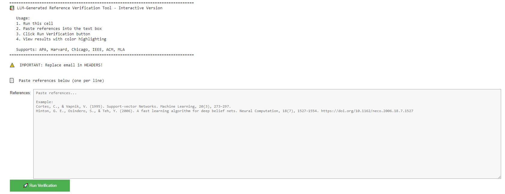
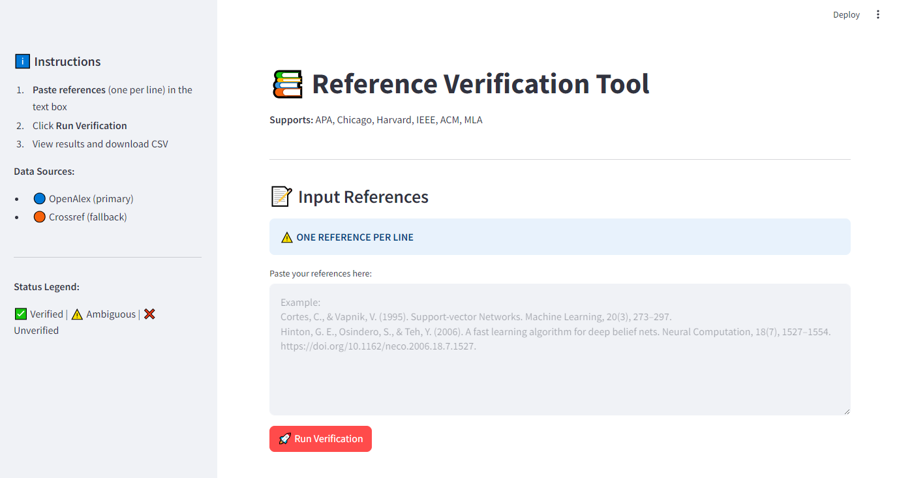

# LLM-Generated Reference Verification Tool

## 0. Brief description

LLM-Generated Reference Verification Tool is a lightweight utility for checking whether references that have been reformatted or touched by large language models still match real, published works. It parses common citation styles (APA, Harvard, Chicago, IEEE, ACM, MLA), extracts key metadata (title, authors, year, journal, volume, issue, pages, DOI), and compares them against open scholarly databases (OpenAlex and Crossref) to flag potential hallucinated references or silent metadata changes introduced during format conversion. The goal is not to encourage generating citations with LLMs, but to provide a post‑hoc safety check when you have used an LLM to batch‑convert existing references between styles and want an extra layer of verification before submission.

## 1. Introduction

Large Language Models (LLMs) are highly prone to "hallucinations" when generating references:

- **Fabricating non-existent literature**
- **Mixing metadata** (authors, years, journals, etc.) from different papers
- **Quietly altering** originally correct reference information during format conversion

In practice, a more common and insidious scenario is:
Users already have real references but simply want LLMs to batch-convert them from one format (e.g., APA) to another (e.g., Harvard, IEEE, etc.). During this process, LLMs may quietly:

- Change the year, volume, issue, or page numbers
- Replace journal names
- Modify or "add" a seemingly reasonable but actually incorrect DOI

### Purpose of This Project:

- **Automatically compare** your provided reference information with metadata from authoritative databases in a structured way
- **Help you self-check** after format conversion to detect whether LLMs have introduced hallucinated references or tampered with metadata
- **Focus on consistency** of key fields: title, authors, year, journal, volume/issue, page range, DOI, etc.

### This Project Does NOT Encourage:

- Using LLMs to directly "generate" references
- Treating this tool as the final authority for "determining whether a reference exists or not"

### Positioning of This Project:

When you already have a list of references and use LLMs to batch-convert formats, you can use this tool for systematic self-checking to help you discover:

- Which references are **verified** (found in databases with high matching confidence)
- Which references are **ambiguous** (partially matched with suspicious discrepancies)
- Which references are **unverified** (cannot be verified in databases or have significant differences)

---

## 2. Project Structure & File Descriptions

This project includes the following main files:

### `README.md`
This documentation, including project introduction, usage guide, output interpretation, and disclaimers.

### `LLM_Generated_Reference_Verification_Tool.ipynb`
**📚 LLM-Generated Reference Verification Tool – Interactive Version (Colab)**

[](https://colab.research.google.com/github/xyshuai/LLM-generated-reference-checker/blob/main/LLM_Generated_Reference_Verification_Tool.ipynb)

- Designed to run directly in Google Colab
- Provides interactive text boxes and color-highlighted result tables
- Suitable for personal use and debugging
  
**Interactive Interface Preview - Colab:**



### `app.py`
**📚 LLM-Generated Reference Verification Tool – Streamlit Version (Local Deployment)**

- Web interface built with Streamlit
- Suitable for local running (Windows / macOS / Linux)
- Supports multiple reference inputs, progress bars, statistics cards, color-coded result tables, CSV export, etc.

**Interactive Interface Preview -Streamlit:**



### `requirements.txt` (Optional)
Lists Python dependencies required to run this project (e.g., streamlit, pandas, rapidfuzz, requests, etc.)

---

## 3. Usage Guide

### 3.1 Interactive Version (Colab)

**Use Cases:**
- Don't want to configure environment on local machine
- Want to run directly in browser and view color-coded tables
- Only need occasional use or small-scale testing

**Steps:**

1. Open `llm_reference_verifier_colab.ipynb` in the GitHub repository
2. Click the "Open in Colab" button (or copy the link and open in Colab)
3. In Colab, run all code cells from top to bottom:
   - First cell installs dependencies (rapidfuzz, pandas, requests, etc.)
   - Middle sections contain core functions: parsing references, calling APIs, comparing metadata, generating result tables
   - Last cell creates an interactive text box and run button
4. In the final interactive interface:
   - Paste your references one per line into the text box
   - Click **🚀 Run Verification** button
   - Wait for progress output and result table generation
5. View in the output:
   - Terminal prints of parsing process and matching information
   - Color-highlighted result table
   - To save, use `df.to_csv('results.csv', index=False)` to export the table

**Important:**
- Carefully read the comments and instructions at the top of the Notebook before running
- Replace the email in `HEADERS` (`your_email@example.com`) with your own email to comply with OpenAlex/Crossref API usage policies

---

### 3.2 Streamlit Version (Local Deployment)

**Use Cases:**
- Want a long-term GUI tool on local machine
- Need to frequently batch-check references
- Want CSV download, real-time statistics, progress display, etc.

#### 3.2.1 Environment Setup

1. **Install Python 3.8+**

2. **Clone this repository:**
   ```bash
   git clone https://github.com/xyshuai/LLM-generated-reference-checker.git
   cd LLM-generated-reference-checker
   ```

3. **Install dependencies** (recommended using requirements.txt):
   ```bash
   pip install -r requirements.txt
   ```
   
   Or manually install core dependencies:
   ```bash
   pip install streamlit pandas rapidfuzz requests
   ```

4. **In `app.py`, replace the email in `HEADERS` with your real email:**
   ```python
   HEADERS = {
       "User-Agent": "ReferenceVerificationTool/1.0 (mailto:your_email@example.com)",
   }
   ```

#### 3.2.2 Starting the Application

Run in the repository root directory:
```bash
streamlit run app.py
```

The browser will automatically open (usually at `http://localhost:8501`).

#### 3.2.3 Usage Steps

1. **After opening the page**, you'll see at the top:
   - Project title: **📚 Reference Verification Tool**
   - Brief description and supported citation formats

2. **In the "📝 Input References" area:**
   - Note the prompt: "ONE REFERENCE PER LINE"
   - Paste references one per line into the text box

3. **Click 🚀 Run Verification button:**
   - Page displays progress bar and current processing status
   - Backend will sequentially:
     - Parse each reference
     - Attempt DOI lookup in OpenAlex
     - If DOI unavailable or doesn't match, search by title in OpenAlex/Crossref
     - Calculate match degree, generate comparison results and status labels

4. **View results area:**
   - **Top:** Statistics cards (Verified / Ambiguous / Unverified / Retracted counts and percentages)
   - **Middle:** Statistics by document type (Journal/Conference/Book Chapter) and data source (OpenAlex / Crossref / None)
   - **Bottom:** Color-highlighted detailed table (one row per reference)

5. **To export results:**
   - Click **💾 Download Results (CSV)** button
   - Save the generated CSV locally for further analysis in Excel or other tools

---

## 4. Interpreting Output Results

### 4.1 Data Sources: OpenAlex & Crossref

This tool sequentially uses two open academic data sources:

#### **OpenAlex**
- An open academic graph and literature index covering numerous journal articles, conference papers, book chapters, etc.
- Provides detailed metadata: title, authors, journal, volume/issue, page range, publication year, DOI, document type, etc.
- **Important feature:** Can flag whether a document is retracted (`is_retracted` field), helping users identify potentially problematic literature

#### **Crossref**
- A widely-used DOI registration agency and literature metadata repository
- Used as a **fallback data source** when OpenAlex cannot match (e.g., missing certain fields or recently updated literature)
- Also provides title, authors, journal, volume/issue, page range, year, DOI, etc.

**Query Logic:**

1. **If reference contains DOI:**
   - First search by DOI in OpenAlex
   - If not found, try Crossref

2. **If reference lacks DOI, or DOI doesn't match title:**
   - Fuzzy search by title in OpenAlex
   - If insufficient match or no results, search by title in Crossref

---

### 4.2 Output Table Field Descriptions

Each reference becomes one row with two categories of information:

#### 4.2.1 Original Reference Information (parsed from your input)

- `raw_reference`: Original input reference string
- `ref_title`: Title parsed from text
- `ref_first_author`: First author (or first name in author string)
- `ref_year`: Parsed year (from parentheses, bare year, or date)
- `ref_journal`: Parsed journal name / conference name / publication source
- `ref_volume`: Volume number
- `ref_issue`: Issue number
- `ref_page_range`: Page range, normalized (e.g., 673–684 → 673-684)
- `doi`: DOI detected in original reference (if any)

#### 4.2.2 Database-Returned Metadata (OpenAlex/Crossref)

- `oa_title`: Title from database
- `oa_full_author`: Complete author list from database
- `oa_first_author`: First author from database
- `oa_year`: Publication year from database
- `oa_journal`: Journal name or publication source from database
- `oa_volume`: Volume number
- `oa_issue`: Issue number
- `oa_page_range`: Page range (normalized)
- `oa_doi`: DOI from database
- `openalex_id`: Work ID in OpenAlex (if from OpenAlex) or marked as "Crossref"
- `doc_type`: Document type (e.g., Journal Article, Conference Paper, Book Chapter, Preprint, etc.)
- `is_retracted`: Whether flagged as retracted (True / False)
- `data_source`: Matched database source (OpenAlex / Crossref / None)

#### 4.2.3 Difference & Comparison Fields

- `oa_title_diff`: Whether title differs (boolean)
- `oa_full_author_diff`: Whether first author surname differs (boolean)
- `oa_year_diff`: Year difference type:
  - `False`: Exact match
  - `"minor"`: Year difference within 2 years (e.g., 2019 vs 2020, considering early/late publication or online versions)
  - `True`: Significant year difference
- `oa_year_delta`: Numeric year difference (e.g., 1, 2, 5, etc.)
- `oa_journal_diff` / `oa_volume_diff` / `oa_issue_diff` / `oa_page_range_diff`: Whether journal, volume, issue, page range differ from database

These fields help you quickly identify:
- Is the title inconsistent, or just a slight year discrepancy?
- Is the author inconsistent, or just minor volume/page differences?

---

### 4.3 Result Categories: verified / ambiguous / unverified

The tool scores matching results based on:

- **Title similarity** (using rapidfuzz token-sort similarity)
- **First author surname match**
- **Year consistency** or within reasonable tolerance (typically ±2 years)

Based on composite scores, each reference is classified as:

#### **verified (Verified)**
Meets most of the following criteria:
- Title highly similar (similarity ≥ 90)
- First author surname matches
- Year difference within 0–2 years range

**This typically indicates:**
- The reference has a clear corresponding record in the database with highly consistent key metadata
- Suitable as positive feedback for "post-format-conversion checking"

#### **ambiguous (Ambiguous)**
Meets some criteria but with significant uncertainty, such as:
- Title similarity to some degree (e.g., 80–89)
- Slight author or year discrepancies
- Only one barely matching result among multiple candidates

**This indicates:**
- The literature may match a database record, but with noticeable differences requiring careful manual verification

#### **unverified (Unverified)**
Includes situations such as:
- No reasonable match found in both OpenAlex and Crossref
- Very low title similarity or inconsistent core metadata
- DOI doesn't exist in database, or DOI severely inconsistent with title

**This does NOT mean "this is a hallucinated reference"**, but rather:
- This tool cannot find a reliable match for this reference in the currently used databases
- You need to further verify the original source yourself (publisher website, journal site, library database, etc.)

---

## 5. Disclaimer (Please Read Carefully)

This project is merely a technical detection tool based on public databases, with the following limitations and risk warnings:

### Not Responsible for Output Accuracy

- All results are based on publicly available metadata from OpenAlex and Crossref
- These databases themselves may have:
  - Cataloging errors or delayed updates
  - Incomplete coverage of certain fields or languages
  - Incomplete indexing of preprints, conference papers, or books
- Therefore, this tool's matching results may be inaccurate or incomplete

### "Unverified" ≠ "Hallucinated Reference"

When a reference is marked as `unverified`, it only means:
- Insufficient strong matching evidence was found in the two databases queried by this tool

This may be because:
- Literature not yet indexed
- Incomplete database records or spelling/format differences
- Special citation format or parsing failure

Therefore, "unverified" does not constitute an assertion about the authenticity or existence of the literature, much less a conclusion that "this is an LLM hallucination."

### Users Have Final Verification Responsibility

This tool only provides auxiliary detection and visualization prompts and cannot replace manual verification.

Before using this tool's results for:
- Academic writing
- Paper submission
- Report writing

You should verify each reference through authoritative channels (journal websites, publisher sites, library databases, etc.).

### Input Format Limitations

- The tool has optimized parsing compatibility for common formats (APA, Harvard, Chicago, IEEE, ACM, MLA), but:
  - If input format severely deviates from these mainstream formats
  - Or mixes multiple styles, incomplete information, incorrect symbols
- Parsing results and subsequent matching will be affected
- For such inputs, the tool's status (especially `ambiguous` and `unverified`) requires more careful interpretation and manual verification

### Not a Tool for Judging Reference Quality

- Any qualitative judgments based on this tool's output require more comprehensive evidence and professional judgment. This project assumes no related responsibility.

### Using This Project Implies Your Agreement to the Following Terms

- You understand and accept the limitations of this tool
- You will not use this tool's results as the sole basis to accuse others or make decisions with serious consequences
- The contributors of this project assume no legal or moral responsibility for any consequences arising from misuse or over-reliance on this tool's results

---

## Acknowledgments & Suggestions

- If you use LLMs only to help "convert formats," this tool can serve as a safety net for post-conversion self-checking
- If you want this project to support more citation formats or other databases (such as PubMed, Semantic Scholar, etc.), Please give us your suggestions!

**We hope this project helps you maintain strict quality control over references while using LLMs.**

---
